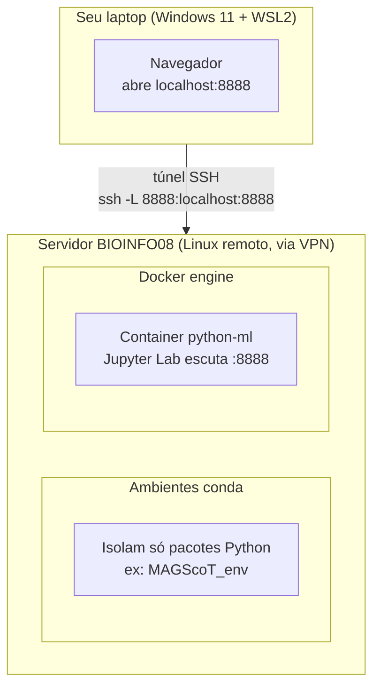

# Tutoriais
Author: Rodrigo Lusa (lusarodrigo4@gmail.com)

> Compilado de referências rápidas de bash e Python (pandas, numpy, matplotlib/seaborn,
> funções, comprehensions, typer) e dos guias de infraestrutura (find, seqkit, Docker,
> Trillium). Objetivo: consultar aqui antes de perguntar pra IA.

## Sumário

- 🐧 [Linux](#linux)
  - [1.1 Script básico](#linux-script-basico)
  - [1.2 if / else](#linux-if-else)
  - [1.3 Loops](#linux-loops)
  - [1.4 Script de checagem rápida](#linux-checagem)
  - [1.5 Extras pra análise rápida de arquivos](#linux-extras)
  - [1.6 find — busca de arquivos](#linux-find)
  - [1.7 seqkit — FASTA/FASTQ](#linux-seqkit)
  - [1.8 Docker + Jupyter remoto](#linux-docker)
  - [1.9 Trillium — cluster SciNet](#linux-trillium)
- 🐍 [Python](#python)
  - [2.1 Pandas](#python-pandas)
  - [2.2 Numpy, Matplotlib e Seaborn](#python-plot)
  - [2.3 Funções](#python-funcoes)
  - [2.4 Dict e List Comprehension](#python-comprehension)
  - [2.5 Typer](#python-typer)
  - [2.6 Python essenciais (argparse + pathlib)](#python-essenciais)
  - [2.7 Análise Exploratória de Dados (EDA)](#python-eda)
- 🔗 [Links Úteis](#links-uteis)

---

<a name="linux"></a>
<details open>
<summary><h1>🐧 1. LINUX / BASH</h1></summary>

<a name="linux-script-basico"></a>

## 1.1 Script básico (anatomia)
```bash
#!/bin/bash
# Shebang: diz ao sistema qual interpretador usar pra rodar o script

# Variáveis (sem espaço ao redor do =)
PASTA="resultados"
EXT=".fasta"

# Usando a variável -> $VAR ou ${VAR}
echo "Procurando arquivos $EXT em $PASTA"

# Argumentos de linha de comando
# $0 = nome do script, $1 = primeiro argumento, $2 = segundo, etc.
# $# = número de argumentos, $@ = todos os argumentos
echo "Script: $0"
echo "Primeiro argumento: $1"
echo "Total de argumentos: $#"

# Rodar: bash script.sh amostra1
```

Dar permissão de execução e rodar direto:
```bash
chmod +x script.sh
./script.sh amostra1
```

<a name="linux-if-else"></a>

## 1.2 if / else
```bash
#!/bin/bash
ARQUIVO=$1

# Sintaxe: espaço depois de [ e antes de ]  é obrigatório
if [ -f "$ARQUIVO" ]; then
    echo "É um arquivo"
elif [ -d "$ARQUIVO" ]; then
    echo "É um diretório"
else
    echo "Não existe: $ARQUIVO"
fi
```

Testes mais usados dentro de `[ ]`:
```bash
-f arquivo      # existe e é arquivo comum
-d pasta        # existe e é diretório
-e caminho      # existe (arquivo ou pasta)
-s arquivo      # existe e não está vazio (size > 0)
-r / -w / -x    # tem permissão de leitura / escrita / execução

# Comparação de strings
[ "$a" == "$b" ]     # igual
[ "$a" != "$b" ]     # diferente
[ -z "$a" ]           # string vazia
[ -n "$a" ]           # string não vazia

# Comparação numérica (NÃO usa == para números)
[ "$a" -eq "$b" ]    # igual
[ "$a" -ne "$b" ]    # diferente
[ "$a" -gt "$b" ]    # maior que
[ "$a" -lt "$b" ]    # menor que
[ "$a" -ge "$b" ]    # maior ou igual
[ "$a" -le "$b" ]    # menor ou igual

# Combinando condições
if [ -f "$ARQUIVO" ] && [ -s "$ARQUIVO" ]; then   # E
if [ -f "$ARQUIVO" ] || [ -d "$ARQUIVO" ]; then   # OU
```

<a name="linux-loops"></a>

## 1.3 Loops (for / while) — pra checagem em massa
```bash
# For sobre arquivos (glob)
for f in *.fastq.gz; do
    echo "Processando $f"
done

# For sobre uma lista de amostras
AMOSTRAS="MAF1 MAF2 MAF3"
for amostra in $AMOSTRAS; do
    echo "Amostra: $amostra"
done

# While lendo linha por linha de um arquivo (ex: lista de samples)
while read -r linha; do
    echo "Sample: $linha"
done < lista_samples.txt
```

<a name="linux-checagem"></a>

## 1.4 Script de checagem rápida (exemplo real de uso)
Padrão pra checar se todos os arquivos esperados de um pipeline existem:
```bash
#!/bin/bash
# uso: bash checar_outputs.sh lista_samples.txt pasta_resultados/

LISTA=$1
PASTA=$2

while read -r sample; do
    ARQ="${PASTA}/${sample}_rgi.txt"
    if [ -s "$ARQ" ]; then
        echo "OK    - $sample"
    else
        echo "FALTA - $sample ($ARQ)"
    fi
done < "$LISTA"
```

<a name="linux-extras"></a>

## 1.5 Extras úteis pra análise rápida de arquivos
```bash
# Contar quantas sequências tem num fasta
grep -c "^>" arquivo.fasta

# Contar linhas de um fastq (÷4 = número de reads)
zcat amostra.fastq.gz | wc -l

# Ver só o cabeçalho de um csv/tsv grande
head -1 tabela.csv

# Checar tamanho de vários arquivos de uma vez
du -sh *.fastq.gz

# Loop + condicional pra mover arquivos vazios pra revisão
mkdir -p revisar
for f in *.txt; do
    if [ ! -s "$f" ]; then
        mv "$f" revisar/
    fi
done

# set -e: para o script se algum comando falhar (bom pra scripts de pipeline)
set -e
set -u   # erro se usar variável não definida
```

<a name="linux-find"></a>

## 1.6 find — cheat sheet para bioinformática

### Sintaxe geral
```bash
find [onde_procurar] [testes] [ações]
```
Pense sempre nessa ordem — `find ONDE TESTES AÇÕES`:
```bash
find . -type f -name "*.fastq.gz" -print
```
- `.` → procurar a partir daqui
- `-type f` → apenas arquivos
- `-name "*.txt"` → arquivos terminados em `.txt`

### Procurar por nome
```bash
find . -name "*.txt"          # todos os .txt
find . -iname "*.txt"         # ignorando maiúsculas/minúsculas
find . -name "*.tsv"
```

### Procurar por caminho completo
Quando você precisa de partes do caminho, não só do nome do arquivo:
```bash
find . -path "*/results/*.txt"                    # tudo dentro de uma pasta "results"
find . -path "*/final_resistome.tsv"               # exemplo real
```
Resultado (ex: em um projeto com várias amostras):
```text
./atlantic_florest/MAF3/resistome/07_final/final_resistome.tsv
./atlantic_florest/MAF1/resistome/07_final/final_resistome.tsv
./atlantic_florest/MAF2/resistome/07_final/final_resistome.tsv
```

### Apenas arquivos / apenas diretórios
```bash
find . -type f
find . -type d
```

### Contagem
```bash
find . -type f | wc -l                        # quantos arquivos existem
find . -name "*.tsv" | wc -l                    # quantos .tsv existem
find atlantic_florest -name "*.fa" | wc -l      # exemplo real
```

### Tempo de modificação
```bash
find . -mtime 0     # modificados nas últimas 24h
find . -mtime -7    # modificados nos últimos 7 dias
find . -mtime +30   # modificados há mais de 30 dias
```

### Arquivos vazios e permissões
```bash
find . -empty          # arquivos vazios
find . -executable      # arquivos executáveis
find . -writable        # arquivos graváveis
```

### Copiar arquivos
```bash
find . -name "*.txt" -exec cp {} backup/ \;          # um por vez
find . -name "*.txt" -exec cp -t backup {} +          # forma mais eficiente (menos processos cp)
```

### Renomear arquivos em massa
Adicionar prefixo:
```bash
find backup/ -name "*.tsv" \
-exec bash -c '
mv "$1" "$(dirname "$1")/OLD_$(basename "$1")"
' _ {} \;
# backup/final_resistome.tsv -> backup/OLD_final_resistome.tsv
```
Adicionar sufixo:
```bash
find . -name "*.txt" \
-exec bash -c '
mv "$1" "${1%.txt}_BACKUP.txt"
' _ {} \;
# arquivo.txt -> arquivo_BACKUP.txt
```
Trocar extensão:
```bash
find . -name "*.txt" \
-exec bash -c '
mv "$1" "${1%.txt}.csv"
' _ {} \;
```

### Operadores lógicos
```bash
find . -type f -name "*.txt"              # AND implícito
find . -type f -a -name "*.txt"           # AND explícito (equivalente)
find . \( -name "*.txt" -o -name "*.csv" \)   # OR
find . ! -name "*.txt"                     # NOT
```

### `-printf` — formatando a saída
```bash
%p    # caminho completo
%f    # apenas o nome do arquivo
%h    # diretório pai
%P    # remove o "./" inicial
```
```bash
find . -path "*/final_resistome.tsv" -printf "%P\n"
# atlantic_florest/MAF3/resistome/07_final/final_resistome.tsv
# atlantic_florest/MAF1/resistome/07_final/final_resistome.tsv
# atlantic_florest/MAF2/resistome/07_final/final_resistome.tsv
```

### Extraindo campos do caminho (cut / rev / awk)
```bash
# Primeiro campo
find . -path "*/final_resistome.tsv" -print0 | tr '\0' '\n' | cut -d/ -f1
# atlantic_florest

# Segundo campo
find . -path "*/final_resistome.tsv" -printf "%P\n" | cut -d/ -f2
# MAF3 / MAF1 / MAF2

# Dois primeiros campos
find . -path "*/final_resistome.tsv" -printf "%P\n" | cut -d/ -f-2
# atlantic_florest/MAF3 ...
```
`cut` não conta de trás pra frente — pra isso, `rev` (inverte a string, corta, inverte de volta):
```bash
# Último campo
find . -path "*/final_resistome.tsv" -printf "%P\n" | rev | cut -d/ -f1 | rev
# final_resistome.tsv

# Penúltimo campo
... | rev | cut -d/ -f2 | rev
# 07_final
```
Método melhor pra contar de trás pra frente — `awk` com `$NF` (last field):
```bash
awk -F/ '{print $NF}'        # último campo
awk -F/ '{print $(NF-1)}'    # penúltimo
awk -F/ '{print $(NF-2)}'    # terceiro a partir do fim
awk -F/ '{print $(NF-3)}'    # quarto a partir do fim

# Exemplo: extrair o nome da amostra do caminho
find . -path "*/final_resistome.tsv" -printf "%P\n" | awk -F/ '{print $(NF-3)}'
# MAF3 / MAF1 / MAF2
```

### Resumo mental

| Quero              | Comando                   |
| ------------------ | -------------------------- |
| Nome do arquivo    | `-name`                     |
| Caminho completo   | `-path`                     |
| Apenas arquivos    | `-type f`                   |
| Apenas diretórios  | `-type d`                   |
| Tamanho            | `-size`                     |
| Tempo              | `-mtime`                    |
| Profundidade       | `-maxdepth`                 |
| Executar comando   | `-exec`                     |
| Imprimir caminho   | `-print`                    |
| Imprimir formatado | `-printf`                   |
| Remover `./`       | `%P`                        |
| Último campo       | `awk -F/ '{print $NF}'`     |
| Penúltimo campo    | `awk -F/ '{print $(NF-1)}'` |
| Contar resultados  | `wc -l`                     |
| Operador AND       | `-a`                        |
| Operador OR        | `-o`                        |
| Operador NOT       | `!`                         |

<a name="linux-seqkit"></a>

## 1.7 seqkit — manipular FASTA e FASTQ

### seqkit — flags principais
```bash
# Estatísticas gerais
seqkit stats file.fa

# Manipular o arquivo de forma geral
seqkit seq [flags]
-n, --name                  # only print names/sequence headers
-r, --reverse                # reverse sequence
-s, --seq                    # only print sequences
-g, --remove-gaps            # remove gap letters
-i, --only-id                # print IDs instead of full headers
-M, --max-len                # only print sequences <= max length (-1 = no limit)
-m, --min-len                # only print sequences >= min length (-1 = no limit)

seqkit seq -m 100 -M 1000    # sequências entre 100 (-m) e 1000 (-M) pb

# Subsequências por região/gtf/bed, incluindo flanking sequences
seqkit subseq [flags]
-u, --up-stream          # tamanho a montante
-d, --down-stream        # tamanho a jusante
-f, --only-flank         # retorna só a sequência flanqueadora
-r, --region             # por região. ex: 1:12 (12 primeiras bases) / -12:-1 (12 últimas) / 13:-1 (corta as 12 primeiras)

# Buscar sequências por ID/nome/sequência/motif
seqkit grep [flags]
-n, --by-name             # busca pelo nome completo, não só o ID
-s, --by-seq              # busca subsequência dentro da seq
-C, --count                # só imprime a contagem de matches (com -v, conta os que não deram match)
-i, --ignore-case          # ignora maiúsculas/minúsculas
-v, --invert-match         # inverte a busca
-m, --max-mismatch         # mismatch máximo ao buscar por sequência
-p, --pattern               # padrão de busca (aceita múltiplos valores)
-f, --pattern-file          # arquivo de padrões (um registro por linha)
-r, --use-regexp            # trata os padrões como regex

seqkit grep -p "contig_name" file.fa
seqkit grep -f list.txt file.fa
seqkit grep -n -f name.txt file.fa
```

### Comandos básicos (grep puro, sem seqkit)
```bash
# Contar quantas sequências existem em um FASTA
cat arquivo.fasta | grep ">" | wc -l
grep -c "^>" arquivo.fasta          # ^ indica início da linha

# Mostrar apenas os nomes das sequências
cat arquivo.fasta | grep ">" | cut -f1
grep "^>" arquivo.fasta | cut -c2-

# Contar quantas reads existem em um FASTQ
cat reads.fq | grep "@" | wc -l

# Listar apenas as sequências (sem os headers)
cat arquivo.fasta | grep -v ">"
grep -v "^>" arquivo.fasta

# Encontrar sequências que contêm um padrão exato (ex: ATG)
cat arquivo.fasta | grep -w "ATG"

# Contar o número total de bases (A, T, G ou C) em um FASTA
grep -v ">" arquivo.fasta | tr -d '\n' | wc -c

# Extrair reads de um FASTQ que contenham "N" na sequência
cat reads.fq | grep "N"
grep -A1 "^@" reads.fq | grep "N"     # -A1: mostra a linha encontrada + 1 linha depois ("after")

# Ordenar os headers de um FASTA em ordem alfabética
grep "^>" arquivo.fasta | sort

# Contar quantas sequências começam com "ATG"
grep -v ">" arquivo.fasta | grep "^ATG" | wc -l
```

<a name="linux-docker"></a>

## 1.8 Docker + Jupyter no servidor remoto

> Arquitetura do ambiente de desenvolvimento da disciplina (repositório `disciplina_python_ml`),
> rodando via Docker no servidor **BIOINFO08**, acessado remotamente via SSH/VPN a partir
> de um laptop com Windows 11 + WSL2.

### O que é um container, de verdade
Um **container** é um processo isolado que roda direto no kernel do sistema operacional
host, mas *enxerga* apenas o próprio sistema de arquivos, os próprios processos e a própria
rede — como se estivesse numa máquina só dele, embora não seja uma máquina virtual de
verdade (não tem hypervisor, não emula hardware).

Analogia: pense em um apartamento dentro de um prédio. O prédio (servidor BIOINFO08) tem
uma estrutura só — encanamento, elétrica, fundação (o kernel Linux). Mas cada apartamento
(container) tem sua própria porta trancada, seus próprios móveis, e o morador de um
apartamento não vê o que tem no armário do vizinho. Só que, ao contrário de apartamentos
de verdade, um container pode ser criado, destruído e recriado em segundos, a partir de
uma "planta" (a imagem).

Como isso se compara ao que você já usa:

| Conceito | O que isola | Onde vive | Compartilha com o host? |
|---|---|---|---|
| **Ambiente conda** (`~/.conda/envs/...`) | Só os pacotes Python | Uma pasta dentro do seu `$HOME` | Sim — mesmo kernel, mesmo sistema de arquivos, mesma rede |
| **Container Docker** | Sistema de arquivos + processos + rede inteiros | Gerenciado pelo Docker engine (`dockerd`) | Só o kernel Linux (compartilhado); todo o resto é isolado |
| **Máquina virtual** | Hardware inteiro (emulado) | Um hypervisor | Nada — nem o kernel |

As peças do Docker:
- **Dockerfile** — a receita: parte de uma imagem base (`python:3.10`), copia arquivos,
  instala pacotes, define o comando de inicialização.
- **Imagem** — o resultado "congelado" de seguir a receita. Só existe uma vez; pode gerar
  N containers a partir dela.
- **Container** — uma instância *rodando* (ou parada) daquela imagem. É o que você vê em `docker ps`.
- **Volume** (`./../script:/usr/src/myapp` no `python_compose.yml`) — uma pasta do host
  "grudada" dentro do container, pra que os arquivos sobrevivam mesmo se o container for
  destruído, e pra você editar os notebooks de fora se quiser.
- **Port mapping** (`8888:8888`) — sem isso, o Jupyter rodando dentro do container ficaria
  isolado, inacessível de fora. Essa linha diz: "pegue a porta 8888 da máquina host e jogue
  pro 8888 de dentro do container".

### Arquitetura do setup

Note que **conda** e **Docker** ficam lado a lado no mesmo servidor, mas nunca se tocam
— são pilhas completamente independentes. O container só existe dentro do Docker engine,
e a porta 8888 dele só existe *dentro do servidor* até você abrir o túnel SSH.

### O que é `ssh -L`, exatamente
```bash
ssh -L 8888:localhost:8888 rodrigo.lusa@BIOINFO08
```
Isso é **port forwarding local** (a flag `-L` = *local*). Lendo da esquerda pra direita:
```
ssh -L  <porta no SEU laptop> : <destino, do ponto de vista do servidor> : <porta de destino>  usuario@servidor
```
- `8888` (primeiro) → a porta que vai abrir **no seu laptop**.
- `localhost` (do meio) → visto **a partir do servidor BIOINFO08** — ou seja, "localhost"
  aqui significa o próprio BIOINFO08, não o seu laptop.
- `8888` (segundo) → a porta **no servidor** que você quer alcançar (a que o Docker
  mapeou pra fora do container).

Ou seja: "abre uma porta 8888 aqui no meu laptop, e tudo que chegar nela, manda através
dessa conexão SSH até o `localhost:8888` do servidor". É um túnel — o tráfego passa
criptografado dentro da própria conexão SSH, sem precisar abrir nenhuma porta nova no
firewall.

Por isso são **necessários 2 terminais rodando ao mesmo tempo**: um mantém o container
vivo, o outro mantém o túnel vivo. Se qualquer um dos dois fechar, o link do navegador
para de funcionar.

### Rotina do dia a dia (depois do primeiro setup)
**Terminal 1 — sobe o container** (já não precisa de `--build`, a imagem já foi construída):
```bash
cd ~/LACTAS-HELISSON-01/disciplina_python_ml/dev/docker
docker compose -f python_compose.yml up
```
Deixe aberto — ele mostra os logs, e é lá que aparece o link com o token novo a cada vez
que sobe.

**Terminal 2 — abre o túnel**:
```bash
ssh -L 8888:localhost:8888 rodrigo.lusa@BIOINFO08
```
Deixe essa sessão conectada também (não precisa digitar nada nela).

**Navegador** — copie o link do terminal 1 (o token muda toda vez) e cole:
```
http://127.0.0.1:8888/lab?token=<token-do-log>
```

Se fechar a aba do navegador sem querer: nada se perde, é só reabrir o mesmo link enquanto
os dois terminais continuarem de pé. Se os terminais fecharem (ou a VPN cair): repete os
dois comandos acima — o trabalho salvo nos notebooks continua intacto no disco do servidor,
só a conexão precisa ser refeita.

### Commitando ao longo das aulas
O Git roda **no servidor, fora do container** — não precisa entrar no Docker pra nada disso:
```bash
cd ~/LACTAS-HELISSON-01/disciplina_python_ml
git status
git add dev/script/...
git commit -m "aula X: descrição do que foi feito"
git push
```
Como o volume do `python_compose.yml` monta `dev/script` de dentro do container, os
arquivos que você edita no JupyterLab aparecem normalmente nessa pasta no servidor — o
Git enxerga como qualquer edição comum.

### Referência rápida de comandos

| Ação | Comando |
|---|---|
| Subir o container | `docker compose -f python_compose.yml up` |
| Subir em background | `docker compose -f python_compose.yml up -d` |
| Ver containers rodando | `docker ps` |
| Parar o container | `docker compose -f python_compose.yml down` |
| Reconstruir a imagem (só se mudar o `requirements.txt`) | `docker compose -f python_compose.yml up --build` |
| Abrir o túnel SSH | `ssh -L 8888:localhost:8888 rodrigo.lusa@BIOINFO08` |

<a name="linux-trillium"></a>

## 1.9 Trillium — cluster SciNet

> Large parallel cluster construído pela Lenovo Canada e hospedado pelo SciNet na
> University of Toronto.

Diretórios principais:
- `/home` – arquivos pessoais e configurações.
- `/scratch` – armazenamento temporário de alta velocidade pra dados de job.
- `/project` – armazenamento compartilhado pra times/colaborações.

```bash
# Entrar no sistema
ssh -i ~/.ssh/ssh_key lusaro@trillium.alliancecan.ca

# Copiar arquivos do sistema para o computador local
scp -i ~/.ssh/ssh_key lusaro@trillium.alliancecan.ca:/scratch/lusaro/arquivo .
    # -r se for pasta
```

Trillium usa o sistema de environment modules pra gerenciar compiladores, bibliotecas e
outros pacotes de software:
```bash
module load <module-name>  # carrega a versão padrão de um pacote
module purge                # descarrega todos os módulos carregados
module avail                 # lista módulos disponíveis pra carregar
module list                  # mostra os módulos carregados no momento
module spider                # busca módulos disponíveis e suas versões
```

Script básico pra submeter um job (SLURM):
```bash
#!/bin/sh
#SBATCH -J NOME_DO_JOB
#SBATCH --time=3:00:00
#SBATCH --ntasks-per-node=40
#SBATCH --nodes=1

cd $SLURM_SUBMIT_DIR

module load CCEnv nixpkgs/16.09

parallel -j $SLURM_TASKS_PER_NODE <<EOF #opcional. Apenas para scripts em paralelo

<commands>

EOF
```
Referência rápida de flags do SBATCH mais usadas:
```bash
-J NOME            # nome do job
--time=HH:MM:SS    # tempo máximo alocado
--nodes=N          # número de nós
--ntasks-per-node=N # tarefas/cores por nó
--mem=16G           # memória alocada
-o saida.out         # arquivo de saída (stdout)
-e erro.err           # arquivo de erro (stderr)
```
```bash
# Comandos de gestão de job
sbatch script.sh     # submete o job
squeue -u $USER       # ver seus jobs na fila
scancel <job_id>       # cancela um job
sacct -j <job_id>       # histórico/status de um job já rodado
```

</details>

---

<a name="python"></a>
<details open>
<summary><h1>🐍 2. PYTHON</h1></summary>

<a name="python-pandas"></a>
<details>
<summary><h2>2.1 Pandas</h2></summary>

### 2.1.1 Do caderno (transcrição completa)

**Import e inspeção**
```python
df = pd.read_csv('file')              # csv
df = pd.read_csv('file', sep='\t')    # tsv

df.columns                            # nomes das colunas
df.dtypes                             # tipo de cada coluna
df.describe()                         # estatísticas gerais (numéricas)
```

**Seleção de colunas e filtro**
```python
df['coluna']
df[['coluna1', 'coluna2']]            # lista de colunas

# Filtrar
df[df['Amostra'] == 'MAF1']
df[df['Amostra'].isin(['MAF1', 'MAF2'])]

# And / Or -> sempre com parênteses em cada condição (x | y)
df[(df['LFQ'] > 10) & (df['p'] < 0.05)]

# Texto
df[df['gene'].str.contains('ribosom', case=False)]
```

**Query**
```python
df.query('coluna < 0.05')
df.query('coluna > 8 and tipo < 6')
```

**Valores únicos**
```python
df['Amostra'].unique()                # lista
df['Amostra'].nunique()               # int
df['Amostra'].value_counts()
df['Amostra'].value_counts(normalize=True)
df['Amostra'].value_counts().to_dict()
```

**Ordenação**
```python
df.sort_values('LFQ', ascending=True)   # ou ascending=False
```

**Renomear / criar colunas**
```python
df.rename(columns={'old': 'new'})

df['log2FC'] = df['c1'] - df['c2']
df['sig'] = df['padj'] < 0.05
```

**Apply**
```python
df['gene'].apply(função)
```

**Strings**
```python
df['coluna'].str.strip()
df['coluna'].str.lower()
df['coluna'].str.split(';')
df['coluna'].str.contains('x')
df['coluna'].str.replace('x', 'y')
```

**Crosstab**
```python
pd.crosstab(df['Amostra'], df['Drug'])
#          Drug1  Drug2 ...
# Amostra1   freq   freq
# Amostra2   freq   freq
# equivalente a: df.groupby([...]).size().unstack()

pd.crosstab(df['A'], df['B'], normalize='index')
# margins=True   # adiciona totais de linha/coluna
```

**Rank**
```python
df.groupby('Amostra')['LFQ'].rank()
```

**Pivot table**
```python
df.pivot_table(index='gene', columns='Amostra', values='LFQ')
# gene  Am  LFQ            gene  V1   V2
# A     V1  100     ->     A     100  120
# A     V2  120            B     80   NaN
# B     V1  80
```

**Indexação — `.loc` vs `.iloc`**
```python
df.loc[linha, coluna]      # usa rótulos (nomes)
df.loc[:, 'coluna']
df.loc[df['coluna'] == 'a']

df.iloc[linha, coluna]     # usa índices (posição)
df.iloc[:, 0:3]
```

**Contas por linha**
```python
df[colunas].função(axis=1)

# soma
df['soma'] = df[colunas].sum(axis=1)

# média
df[colunas].mean(axis=1)
```

**Filtrar coluna por padrão (nome)**
```python
df.filter(like='LFQ', axis=1).columns
```

**Explode**
```python
df = df.explode('drug_class')
# x drug_class     ->   x drug
# bla [1,2]             bla 1
#                        bla 2
```

**Groupby**
```python
df.groupby(by='Amostra').size()                    # contagem
df.groupby('Amostra')['LFQ'].mean()
df.groupby(['Amostra', 'drug']).size()
#          A  d1  3
#             d2  4
#          B  d1  3
#             d2  5
```

**Reset index** — transforma o índice do groupby em coluna
```python
r = (df.groupby('Amostra')
       .size()
       .reset_index(name='count'))
# Amostra  count
# A        3
# B        4
```

**Pivot (via groupby + unstack)**
```python
(df.groupby(['Amostra', 'DC'])
   .size()
   .unstack(fill_value=0))   # preenche combinações faltantes com 0
```

**Merge**
```python
df = pd.merge(df1, df2, on='gene')
# how='left'

pd.concat([df1, df2])
```

**Drop**
```python
df.drop_duplicates()
df.drop_duplicates(subset='gene')   # duplicata considerando só essa coluna
```

**NaN**
```python
df.isna().sum()
df.dropna()
df.fillna(0)
```

**Filtrar top genes**
```python
df.nlargest(20, 'LFQ')
df.nsmallest(20, 'LFQ')
```

**Salvar**
```python
df.to_csv('nome.csv', index=False)
# sep='\t'  para tsv
```

**Dict comprehension**
```python
dict_novo = {key: value for (key, value) in iteration}
```

### 2.1.2 Complemento (o que não estava no caderno)

Filtros extras:
```python
# ~ nega a condição
df[~df['gene'].isin(['blaKPC'])]   # tudo MENOS blaKPC

# where / mask: mantém o shape, troca valor em vez de filtrar linha
df['LFQ'].where(df['LFQ'] > 0, other=0)   # negativo vira 0
```

Tipos e conversão:
```python
df['coluna'] = df['coluna'].astype(float)
df['coluna'] = pd.to_numeric(df['coluna'], errors='coerce')  # vira NaN se não converter
df['data'] = pd.to_datetime(df['data'])
```

Apply na linha inteira e map:
```python
# apply na linha inteira (axis=1) -> quando a função precisa de mais de uma coluna
df['risco'] = df.apply(lambda row: 'alto' if row['LFQ'] > 100 and row['p'] < 0.05 else 'baixo', axis=1)

# map: troca valores usando um dicionário (bom pra renomear categorias)
mapa = {'V1': 'Variante1', 'V2': 'Variante2'}
df['Amostra_nome'] = df['Amostra'].map(mapa)
```

Groupby avançado:
```python
# Múltiplas agregações de uma vez
df.groupby('Amostra')['LFQ'].agg(['mean', 'std', 'count'])

# Agregações diferentes por coluna
df.groupby('Amostra').agg({'LFQ': 'mean', 'p': 'min'})

# Nomeando a coluna resultante direto
df.groupby('Amostra').agg(LFQ_medio=('LFQ', 'mean'))

# transform: devolve o resultado no mesmo shape do df original (bom pra normalizar por grupo)
df['LFQ_norm'] = df['LFQ'] / df.groupby('Amostra')['LFQ'].transform('sum')
```

Merge com mais detalhe:
```python
# how: 'inner' (padrão, só o que casa), 'left', 'right', 'outer' (tudo)
pd.merge(df1, df2, on='gene', how='left')

# Quando o nome da coluna-chave é diferente nos dois dfs
pd.merge(df1, df2, left_on='gene_id', right_on='ARO', how='left')

# indicator=True: mostra de onde veio cada linha (útil pra debugar merge)
pd.merge(df1, df2, on='gene', how='outer', indicator=True)
```

Outros formatos de salvamento:
```python
df.to_excel('saida.xlsx', index=False)
df.to_parquet('saida.parquet')     # mais rápido e leve pra tabelas grandes (usado no ARGOS)
pd.read_parquet('saida.parquet')
```

</details>

<a name="python-plot"></a>
<details>
<summary><h2>2.2 Numpy, Matplotlib e Seaborn</h2></summary>

### 2.2.1 Numpy — o essencial
```python
import numpy as np

arr = np.array([1, 2, 3, 4, 5])
arr.shape                       # dimensões
arr.mean(); arr.std(); arr.sum()
np.log2(arr)                    # bom pra fold-change
np.log10(arr + 1)               # +1 evita log(0)

# Arrays 2D (tipo uma matrix de presença/ausência)
matrix = np.zeros((5, 3))       # matriz de zeros 5x3
matrix = np.ones((5, 3))
np.where(arr > 2, 'alto', 'baixo')   # vetorizado, equivalente a apply(lambda) linha a linha

# Random (pra simulação/teste)
np.random.seed(42)              # reprodutibilidade
np.random.normal(0, 1, size=100)
```

### 2.2.2 Matplotlib — parâmetros completos por tipo de gráfico

Setup básico:
```python
import matplotlib.pyplot as plt

fig, ax = plt.subplots(figsize=(8, 5), dpi=100)
# figsize=(largura, altura) em polegadas; dpi = resolução

ax.set_title('Título', fontsize=14)
ax.set_xlabel('Eixo X')
ax.set_ylabel('Eixo Y')
ax.legend(loc='best')           # 'upper right', 'lower left', 'best', etc.
plt.tight_layout()              # evita corte de labels
plt.savefig('figura.png', dpi=300, bbox_inches='tight')
plt.show()
```

**Scatter**
```python
ax.scatter(
    x, y,
    c=cores,              # cor por ponto (array numérico ou lista de cores)
    s=tamanhos,            # tamanho por ponto (array ou valor único)
    cmap='viridis',        # paleta, usada só se c for numérico
    alpha=0.7,             # transparência (0-1)
    edgecolors='black',
    linewidths=0.5,
    marker='o',            # 'o', 's', '^', 'x', 'D', etc.
)
```

**Bar**
```python
ax.bar(
    x, altura,
    width=0.8,
    color='steelblue',     # ou lista de cores, uma por barra
    edgecolor='black',
    linewidth=0.5,
    align='center',        # 'center' ou 'edge'
    yerr=erros,            # barra de erro (opcional)
    capsize=4,
)
```

**Line**
```python
ax.plot(
    x, y,
    color='crimson',
    linestyle='-',          # '-', '--', '-.', ':'
    linewidth=2,
    marker='o',
    markersize=5,
    label='LFQ médio',
)
```

**Boxplot**
```python
ax.boxplot(
    [grupo1, grupo2, grupo3],
    labels=['A', 'B', 'C'],
    showfliers=True,        # mostrar outliers
    patch_artist=True,      # permite colorir as caixas
)
```

**Heatmap "cru" (imshow)**
```python
im = ax.imshow(matrix, cmap='viridis', aspect='auto', vmin=0, vmax=1)
plt.colorbar(im, ax=ax, label='valor')
```

### 2.2.3 Compondo e ajustando o gráfico

**Adicionar linhas a um gráfico já existente** — chame `ax.plot`/`ax.axhline`/`ax.axvline`
de novo no mesmo `ax`, sem criar uma figura nova:
```python
fig, ax = plt.subplots(figsize=(8, 5))
ax.plot(x, y1, label='Amostra A')
ax.plot(x, y2, label='Amostra B')          # segunda linha, mesmo eixo

# Linhas de referência (ex: threshold de significância)
ax.axhline(y=0.05, color='red', linestyle='--', linewidth=1, label='p = 0.05')
ax.axvline(x=0, color='gray', linestyle=':', linewidth=1)

# Linha diagonal genérica (ex: y=x numa comparação)
ax.axline((0, 0), slope=1, color='black', linestyle='--', linewidth=0.8)

ax.legend()
```

**Mudar título e "proporção" do gráfico**
```python
ax.set_title('Novo título', fontsize=14, fontweight='bold')
fig.suptitle('Título geral da figura', fontsize=16)   # quando tem vários subplots

# Proporção/tamanho da figura inteira
fig, ax = plt.subplots(figsize=(10, 4))    # largura maior que altura -> mais "wide"
fig, ax = plt.subplots(figsize=(6, 6))     # quadrado

# Proporção dos EIXOS dentro do gráfico (não da figura)
ax.set_aspect('equal')       # 1 unidade em x = 1 unidade em y (bom pra PCoA/PCA)
ax.set_aspect('auto')        # padrão, deixa esticar livremente
ax.set_aspect(2)             # y comprimido/esticado 2x em relação a x
```

**Mudar a posição da legenda**
```python
ax.legend(loc='upper right')     # 'upper left', 'upper right', 'lower left',
                                  # 'lower right', 'center', 'best', etc.

# Legenda FORA do gráfico (bbox_to_anchor + loc controlam o ponto de ancoragem)
ax.legend(loc='center left', bbox_to_anchor=(1.02, 0.5))   # à direita, fora do plot
ax.legend(loc='upper center', bbox_to_anchor=(0.5, -0.15), ncol=3)  # embaixo, em linha

# Outros ajustes úteis
ax.legend(title='Grupo', frameon=False, fontsize=9)
```

**Subplots — plotar um do lado do outro**
```python
# 1 linha, 2 colunas -> lado a lado
fig, axes = plt.subplots(1, 2, figsize=(12, 5))
axes[0].scatter(x1, y1)
axes[0].set_title('Clínico')
axes[1].scatter(x2, y2)
axes[1].set_title('Ambiental')
plt.tight_layout()

# 2 linhas, 2 colunas -> grade 2x2 (indexa como matrix)
fig, axes = plt.subplots(2, 2, figsize=(10, 8))
axes[0, 0].plot(x, y)
axes[0, 1].bar(x, y)
axes[1, 0].boxplot(dados)
axes[1, 1].imshow(matrix)

# sharex/sharey -> eixos compartilhados entre os subplots (bom pra comparação direta)
fig, axes = plt.subplots(1, 2, figsize=(12, 5), sharey=True)
```

### 2.2.4 Seaborn — parâmetros completos por tipo de gráfico

Setup:
```python
import seaborn as sns
sns.set_theme(style='whitegrid')   # 'white', 'dark', 'darkgrid', 'ticks'
```

**Heatmap** (o mais usado no ARGOS)
```python
sns.heatmap(
    matrix,
    cmap='viridis',          # paleta (ver seção 2.2.5)
    annot=True,               # mostra o valor em cada célula
    fmt='.2f',                 # formato do número anotado
    linewidths=0.5,
    linecolor='white',
    vmin=0, vmax=1,             # limites da escala de cor
    cbar_kws={'label': 'valor'},
    square=False,
    xticklabels=True,
    yticklabels=True,
)
```

**Clustermap** (heatmap + dendrograma — equivalente ao `clustered_heatmap` do ARGOS)
```python
sns.clustermap(
    matrix,
    cmap='viridis',
    metric='jaccard',        # ou 'braycurtis', 'euclidean'...
    method='average',         # linkage: 'average', 'complete', 'ward'
    row_cluster=True,
    col_cluster=True,
    figsize=(10, 10),
    annot=False,
)
```

**Barplot / Boxplot / Violinplot**
```python
sns.barplot(data=df, x='Amostra', y='LFQ', hue='drug_class', palette='Set2', errorbar='sd')
sns.boxplot(data=df, x='Amostra', y='LFQ', hue='tipo', palette='pastel')
sns.violinplot(data=df, x='Amostra', y='LFQ', palette='muted', inner='quartile')
```

**Scatterplot**
```python
sns.scatterplot(
    data=df, x='logFC', y='-log10(p)',
    hue='sig',               # colore por categoria
    style='drug_class',       # muda o marcador por categoria
    size='LFQ',                # tamanho do ponto por valor
    palette='coolwarm',
    alpha=0.7,
)
```

**Pairplot** (bom pra EDA — ver seção 2.7)
```python
sns.pairplot(df, hue='tipo', palette='husl', diag_kind='kde')
```

**Seaborn + subplots** — funções `sns.*plot` aceitam `ax=` pra desenhar dentro de um
subplot específico do matplotlib:
```python
fig, axes = plt.subplots(1, 2, figsize=(12, 5))
sns.boxplot(data=df, x='tipo', y='LFQ', ax=axes[0])
sns.violinplot(data=df, x='tipo', y='LFQ', ax=axes[1])
```

### 2.2.5 Paletas de cores prontas
```python
# Contínuas / sequenciais (valores numéricos, ex: heatmap, LFQ)
'viridis'      # padrão robusto, perceptualmente uniforme
'magma' / 'inferno' / 'plasma'   # variações escuro->claro
'Blues' / 'Greens' / 'Reds'       # sequenciais de uma cor só

# Divergentes (valores com ponto central, ex: log2FC, correlação)
'coolwarm'
'RdBu_r'       # vermelho-azul, invertido pra vermelho = positivo
'vlag'

# Categóricas (grupos discretos, ex: Amostra, drug_class)
'Set1' / 'Set2' / 'Set3'
'tab10' / 'tab20'
'husl'         # cores igualmente espaçadas, boa quando tem muitas categorias
'pastel' / 'muted' / 'deep' / 'bright'   # variações de saturação do seaborn

# Definir manualmente (quando quer controlar cor exata por grupo)
paleta_manual = {'clinico': '#d62728', 'ambiental': '#2ca02c'}
sns.boxplot(data=df, x='tipo', y='LFQ', palette=paleta_manual)
```

</details>

<a name="python-funcoes"></a>
<details>
<summary><h2>2.3 Funções — estruturando algo complexo em várias funções</h2></summary>

> Ideia central: uma função = uma responsabilidade. Se você descreve o que a função
> faz e precisa usar "e" no meio da frase, provavelmente ela devia ser duas funções.

### 2.3.1 Anatomia básica
```python
def calcular_media(valores: list[float]) -> float:
    """Calcula a média de uma lista de valores."""
    return sum(valores) / len(valores)

# type hints (valores: list[float], -> float) não são obrigatórios, mas ajudam
# a documentar o que a função espera e retorna sem precisar ler o corpo inteiro
```

### 2.3.2 Argumentos: posicionais, default e keyword-only
```python
def plot_heatmap(df, drug_class=None, cmap='viridis', *, cluster=False):
    # df, drug_class: podem ser passados por posição ou nome
    # cmap='viridis': valor default, não precisa passar se não quiser mudar
    # * antes de cluster: tudo depois só pode ser passado por nome (cluster=True)
    #   -> útil quando a função tem muitos parâmetros e você quer forçar clareza
    #      na chamada (evita plot_heatmap(df, None, 'viridis', True) ilegível)
    ...

plot_heatmap(df, cluster=True)          # ok
# plot_heatmap(df, None, 'viridis', True)  # funcionaria, mas ilegível
```

### 2.3.3 Quebrando um problema complexo em várias funções
Exemplo no espírito do que o `plot_heatmap` do ARGOS faz: uma função "pública" que
orquestra, e funções internas menores que cada uma resolve uma parte.

```python
def plot_heatmap(dataset, drug_class=None, cluster=False, **kwargs):
    """Função pública: valida entrada, decide o caminho e delega."""
    matrix = _prepare_matrix(dataset, drug_class)

    if cluster:
        return _clustered_heatmap(matrix, **kwargs)
    else:
        return _render_heatmap(matrix, **kwargs)


def _prepare_matrix(dataset, drug_class):
    """Só prepara os dados: filtra e pivota. Não sabe nada de plot."""
    df = dataset.full_resistoma
    if drug_class is not None:
        df = df[df['drug_class'] == drug_class]
    return df.pivot_table(index='gene', columns='Amostra', values='count', fill_value=0)


def _render_heatmap(matrix, **kwargs):
    """Só sabe desenhar um heatmap simples. Não sabe de onde veio a matrix."""
    ...


def _clustered_heatmap(matrix, **kwargs):
    """Só sabe calcular distância (Jaccard/Bray-Curtis) e clusterizar."""
    ...
```

Por que separar assim:
- `_prepare_matrix` pode ser testada sozinha, sem precisar gerar nenhum gráfico.
- Se um bug aparece só no modo `cluster=True`, você sabe exatamente onde olhar.
- Funções com `_` na frente (convenção, não regra do Python) sinalizam "uso interno,
  não é pra ser chamada de fora do módulo".
- `**kwargs`: junta argumentos extras num dicionário e repassa pra frente sem
  precisar listar cada um — útil quando a função de baixo nível tem parâmetros
  de estilo (cor, tamanho da figura, etc.) que a de cima só quer repassar.

### 2.3.4 Regra prática pra decidir quando quebrar em mais funções
```python
# Sinais de que já passou do ponto de quebrar:
# - função tem mais de ~30-40 linhas
# - você usa comentários tipo "### agora fazemos X" pra separar blocos dentro dela
#   -> cada bloco comentado é candidato a virar uma função
# - você repete o mesmo trecho de código em dois lugares diferentes
# - pra testar uma parte pequena, você precisa rodar a função inteira
```

### 2.3.5 Docstrings e erro explícito (bom hábito pra funções reutilizáveis)
```python
def load_rgi_output(path: str) -> pd.DataFrame:
    """
    Lê o output do RGI (CARD) e retorna um DataFrame padronizado.

    Parameters
    ----------
    path : str
        Caminho pro arquivo .txt de saída do RGI.

    Returns
    -------
    pd.DataFrame
        Tabela com colunas renomeadas e tipos ajustados.
    """
    if not Path(path).exists():
        raise FileNotFoundError(f"Arquivo não encontrado: {path}")

    df = pd.read_csv(path, sep='\t')
    return df
```

</details>

<a name="python-comprehension"></a>
<details>
<summary><h2>2.4 Dict e List Comprehension</h2></summary>

### 2.4.1 List comprehension — sintaxe
```python
# forma tradicional
lista = []
for x in range(10):
    if x % 2 == 0:
        lista.append(x * 2)

# comprehension equivalente
lista = [x * 2 for x in range(10) if x % 2 == 0]
#         ^valor   ^iteração        ^filtro (opcional)
```

### 2.4.2 Dict comprehension — sintaxe (já estava no caderno)
```python
dict_novo = {chave: valor for (chave, valor) in iteravel}

# Exemplo: inverter um dicionário (valor vira chave)
mapa = {'V1': 'Variante1', 'V2': 'Variante2'}
mapa_invertido = {v: k for k, v in mapa.items()}
# {'Variante1': 'V1', 'Variante2': 'V2'}
```

### 2.4.3 Onde isso aparece de fato no ARGOS
```python
# Contar quantos genes caem em cada Rank (arg_ranker), a partir da tabela de lookup
# Em vez de um loop com if/elif pra cada Rank:
contagem_por_rank = {
    rank: (df['Rank'] == rank).sum()
    for rank in df['Rank'].unique()
}

# Montar um dicionário sample -> caminho do arquivo de output, pra iterar no update()
arquivos_por_sample = {
    sample: Path(pasta_resultados) / f"{sample}_rgi.txt"
    for sample in lista_samples
}

# Filtrar genes de risco alto (Rank I) já achatados numa lista, a partir do dataset
genes_rank1 = [
    gene for gene in dataset.full_resistoma['gene']
    if rank_lookup.get(gene) == 'Rank I'
]

# Combinando comprehension com o padrão de "matriz na granularidade mais fina":
# construir o dict de renomeação gene_clean -> nome ARO cru, aplicado só na hora
# de plotar (groupby), sem alterar a matriz original
gene_clean_map = {
    aro: aro.split('_')[0]
    for aro in dataset.full_resistoma['gene'].unique()
}
```

### 2.4.4 Comprehension aninhada — cuidado com legibilidade
```python
# Achatando uma lista de listas (ex: genes por amostra -> lista única de genes)
genes_por_amostra = [['blaKPC', 'blaNDM'], ['blaOXA'], ['blaKPC']]
todos_genes = [gene for sublist in genes_por_amostra for gene in sublist]
# ['blaKPC', 'blaNDM', 'blaOXA', 'blaKPC']

# Regra prática: se a comprehension passa de ~2 níveis (2 "for") ou fica difícil
# de ler numa linha, é melhor voltar pro loop tradicional — comprehension é
# sobre legibilidade, não sobre economizar linhas.
```

### 2.4.5 Set comprehension (bônus — pra valores únicos)
```python
genes_unicos = {gene for sublist in genes_por_amostra for gene in sublist}
# {'blaKPC', 'blaNDM', 'blaOXA'}  -> sem repetição, sem ordem garantida
```

</details>

<a name="python-typer"></a>
<details>
<summary><h2>2.5 Typer — CLI (alternativa mais moderna ao argparse)</h2></summary>

> `pip install typer`. Usa type hints da função pra gerar o parser automaticamente
> — menos código repetido que argparse pra CLIs simples.

### 2.5.1 Básico
```python
import typer

app = typer.Typer()

@app.command()
def saudacao(nome: str, vezes: int = 2):
    """Imprime uma saudação `vezes` vezes."""
    for _ in range(vezes):
        typer.echo(f"Olá, {nome}!")

if __name__ == "__main__":
    app()
```
```bash
python script.py rodrigo            # usa o default vezes=2
python script.py rodrigo --vezes 1
python script.py --help             # help gerado automaticamente
```

### 2.5.2 Argumento opcional com `Optional` e flags booleanas
```python
from typing import Optional
import typer

app = typer.Typer()

@app.command()
def processar(
    arquivo: str,
    saida: Optional[str] = None,     # opcional, default None
    verbose: bool = False,           # vira flag: --verbose / --no-verbose
):
    saida = saida or f"{arquivo}_processado.csv"
    if verbose:
        typer.echo(f"Processando {arquivo} -> {saida}")
    ...
```
```bash
python script.py dados.csv --verbose
python script.py dados.csv --saida final.csv
```

### 2.5.3 Múltiplos comandos no mesmo app (bom pra CLI de pipeline/toolkit)
```python
import typer

app = typer.Typer()

@app.command()
def rodar(sample: str):
    """Roda a análise pra uma amostra."""
    typer.echo(f"Rodando {sample}")

@app.command()
def status(sample: str):
    """Checa o status de uma amostra já processada."""
    typer.echo(f"Status de {sample}: ok")

if __name__ == "__main__":
    app()
```
```bash
python script.py rodar MAF1
python script.py status MAF1
python script.py --help          # lista os dois comandos
python script.py rodar --help    # help específico do comando
```

### 2.5.4 Validação e choices (equivalente ao `choices=` do argparse)
```python
from enum import Enum
import typer

class Formato(str, Enum):
    csv = "csv"
    tsv = "tsv"
    parquet = "parquet"

@app.command()
def exportar(arquivo: str, formato: Formato = Formato.csv):
    typer.echo(f"Exportando como {formato.value}")
```
```bash
python script.py exportar dados        # usa csv (default)
python script.py exportar dados --formato parquet
python script.py exportar dados --formato xml   # erro: não é uma opção válida
```

### 2.5.5 Path como tipo (valida e converte automaticamente)
```python
from pathlib import Path
import typer

@app.command()
def carregar(arquivo: Path):
    if not arquivo.exists():
        typer.echo(f"Arquivo não encontrado: {arquivo}", err=True)
        raise typer.Exit(code=1)
    typer.echo(f"Carregando {arquivo}")
```

</details>

<a name="python-essenciais"></a>
<details>
<summary><h2>2.6 Python essenciais (argparse + pathlib, do zip)</h2></summary>

> Consolidado de `python/argparse.py` e `python/pathlib.py`. `argparse` é a
> alternativa mais antiga/verbosa ao typer (seção 2.5) — útil saber ler, mesmo
> usando typer pra escrever CLIs novas.

### 2.6.1 argparse — básico
```python
import argparse

parser = argparse.ArgumentParser()

# Argumento posicional (obrigatório, sem --)
parser.add_argument('greeting', type=str, help='The greeting message to display')

# Argumento opcional (com -- ou -)
parser.add_argument('-t', '--times', type=int, help='Number of times to display the greeting')
parser.set_defaults(times=2)

args = parser.parse_args()

for i in range(args.times):
    print(args.greeting)
```
```bash
python teste_arg.py oi
# oi
# oi
python teste_arg.py oi -t 1
# oi
```

### 2.6.2 argparse — choices (restringir valores aceitos)
```python
import argparse

parser = argparse.ArgumentParser()
parser.add_argument('greeting', type=str, help='The greeting message to display')
parser.add_argument('-l', '--language', type=str, choices=['en', 'pt'], help='Language of the greeting')
parser.set_defaults(language='pt')

args = parser.parse_args()

for i in range(args.times):
    if args.language == 'pt':
        print(f"Olá! {args.greeting}")
    else:
        print(f"Hello! {args.greeting}")
```
```bash
python teste_arg.py rodrigo
# Olá! rodrigo
python teste_arg.py rodrigo -l en
# Hello! rodrigo
```

### 2.6.3 pathlib — manipulação de caminhos
```python
from pathlib import Path

# Diretório atual
print(Path.cwd())

# Listar tudo no diretório atual
for p in Path().iterdir():
    print(p)

### Manipulando partes do caminho
script = Path("teste_arg.py")
print(script.suffix)   # .py -> só a extensão
print(script.stem)     # teste_arg -> nome sem extensão
print(script.parent)   # . -> diretório pai

### Criar diretório e arquivo
new_dir = Path("diretorio_1")
new_dir.mkdir(exist_ok=True)          # não dá erro se já existir

new_file = new_dir / "novo_arquivo.txt"
print(new_file.absolute())
new_file.touch(exist_ok=True)

### Caminhos relativos, absolutos e home
Path("..").absolute()      # caminho absoluto sem resolver ".."
Path("..").resolve()       # resolve ".." e links simbólicos
Path(__file__).resolve()   # caminho absoluto do próprio script
Path.home()                # diretório home do usuário

### Glob — buscar arquivos por padrão
for p in Path().glob("*.py"):     # só no diretório atual
    print(p)

for p in Path().rglob("*.py"):    # recursivo (subpastas também)
    print(p)

### Ler e escrever arquivos
arquivo = Path.home() / "testes/teste_arg.py"
with arquivo.open() as f:
    print(f.read())
```

</details>

<a name="python-eda"></a>
<details>
<summary><h2>2.7 Análise Exploratória de Dados (EDA)</h2></summary>

### 2.7.1 Roteiro mínimo só com pandas/seaborn (sem instalar nada novo)
```python
df.shape                       # (linhas, colunas)
df.info()                      # tipos + quantos non-null por coluna
df.describe(include='all')     # estatísticas (numéricas e categóricas)
df.isna().sum().sort_values(ascending=False)   # onde estão os NaN
df.nunique()                   # cardinalidade de cada coluna (detecta ID vs categoria)

# Correlação entre variáveis numéricas
sns.heatmap(df.corr(numeric_only=True), cmap='coolwarm', annot=True, center=0)

# Distribuição de cada variável numérica de uma vez
df.hist(figsize=(12, 8), bins=30)

# Relação entre pares de variáveis, colorido por categoria
sns.pairplot(df, hue='tipo', palette='husl')

# Duplicatas
df.duplicated().sum()
```

### 2.7.2 Bibliotecas que fazem o relatório automático
Quando quer um overview rápido sem escrever tudo isso na mão:

- **ydata-profiling** (antigo `pandas-profiling`) — o mais completo: gera um HTML
  com distribuição, correlação, valores faltantes, alertas de qualidade (colunas
  constantes, alta cardinalidade, correlação alta entre pares) pra cada coluna.
  ```python
  from ydata_profiling import ProfileReport
  profile = ProfileReport(df, title="EDA", minimal=False)
  profile.to_file("eda_report.html")
  ```
  `minimal=True` deixa mais rápido em datasets grandes (pula algumas correlações caras).

- **sweetviz** — parecido, mais rápido de gerar, bom pra comparar dois datasets lado
  a lado (ex: treino vs teste, ou clínico vs ambiental).
  ```python
  import sweetviz as sv
  report = sv.compare([df_clinico, "Clínico"], [df_ambiental, "Ambiental"])
  report.show_html("comparacao.html")
  ```

- **missingno** — visualização específica pra padrão de dados faltantes (matriz,
  barra, dendrograma de correlação entre ausências). Útil quando o NaN não é
  aleatório (ex: um gene só é reportado se passou de um threshold).
  ```python
  import missingno as msno
  msno.matrix(df)
  msno.heatmap(df)   # correlação entre "faltar" em uma coluna e faltar em outra
  ```

### 2.7.3 Recomendação prática
Pra uma checagem rápida do dia a dia (ex: conferir uma tabela nova do RGI/CARD
antes de meter no pipeline): `df.info()` + `df.describe()` + `df.isna().sum()`
já resolve. Pra um relatório que vai ser revisado por outra pessoa (banca,
supervisor) ou quando o dataset é novo e desconhecido: vale rodar `ydata-profiling`
uma vez e olhar os alertas — ele aponta coisas que passariam despercebidas
(coluna quase toda igual, dois campos muito correlacionados, outlier extremo).

</details>

</details>

---

<a name="links-uteis"></a>
<details>
<summary><h1>🔗 Links Úteis</h1></summary>

- Metagenomics workshop - https://denbi-simplevm-metagenomics-workshop.readthedocs.io/en/latest/index.html
- Computational Genomics with R - https://compgenomr.github.io/book/
- Conceitos estatísticos - https://zoehlerbz.medium.com
- Curso DEseq - https://colab.research.google.com/drive/1cjsBESHsHwzFy2-92FZR82-bMkBWiCkk#scrollTo=JEiG9lHo7Ie-
- Curso R (introdução) - https://wapsyed.github.io/cursor/#sobre-o-curso
- Conda cheatsheet - https://docs.conda.io/projects/conda/en/latest/_downloads/843d9e0198f2a193a3484886fa28163c/conda-cheatsheet.pdf
- CS50's Introduction to Programming with Python - https://cs50.harvard.edu/python/

</details>
