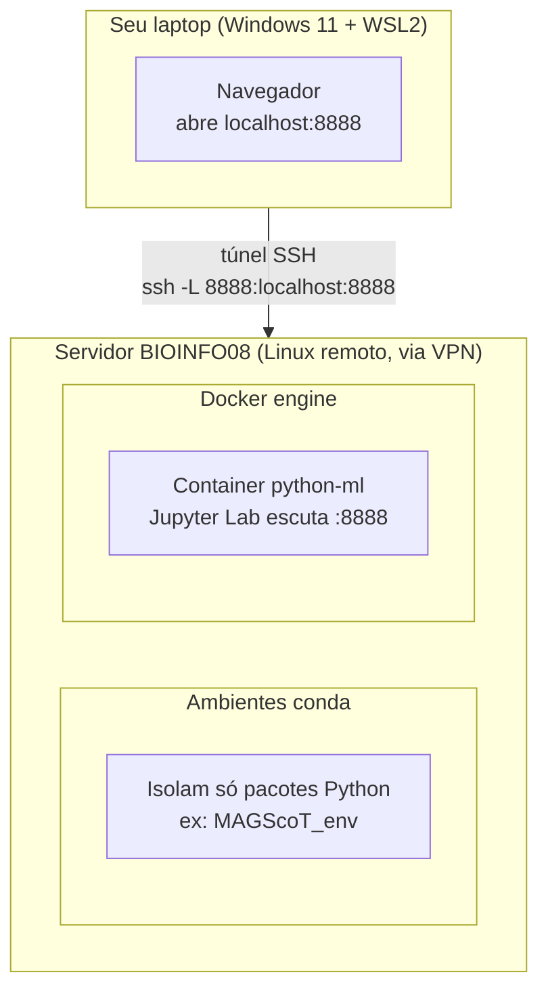

# Docker + Jupyter no servidor remoto — guia da disciplina Python ML

Este documento explica a arquitetura do ambiente de desenvolvimento da disciplina (repositório `disciplina_python_ml`), rodando via Docker no servidor **BIOINFO08**, acessado remotamente via SSH/VPN a partir de um laptop com Windows 11 + WSL2.

---

## 1. O que é um container, de verdade

Um **container** é um processo isolado que roda direto no kernel do sistema operacional host, mas *enxerga* apenas o próprio sistema de arquivos, os próprios processos e a própria rede — como se estivesse numa máquina só dele, embora não seja uma máquina virtual de verdade (não tem hypervisor, não emula hardware).

Analogia: pense em um apartamento dentro de um prédio. O prédio (servidor BIOINFO08) tem uma estrutura só — encanamento, elétrica, fundação (o kernel Linux). Mas cada apartamento (container) tem sua própria porta trancada, seus próprios móveis, e o morador de um apartamento não vê o que tem no armário do vizinho. Só que, ao contrário de apartamentos de verdade, um container pode ser criado, destruído e recriado em segundos, a partir de uma "planta" (a imagem).

Como isso se compara ao que você já usa:

| Conceito | O que isola | Onde vive | Compartilha com o host? |
|---|---|---|---|
| **Ambiente conda** (`~/.conda/envs/...`) | Só os pacotes Python | Uma pasta dentro do seu `$HOME` | Sim — mesmo kernel, mesmo sistema de arquivos, mesma rede |
| **Container Docker** | Sistema de arquivos + processos + rede inteiros | Gerenciado pelo Docker engine (`dockerd`) | Só o kernel Linux (compartilhado); todo o resto é isolado |
| **Máquina virtual** | Hardware inteiro (emulado) | Um hypervisor | Nada — nem o kernel |

### As peças do Docker

- **Dockerfile** — a receita: parte de uma imagem base (`python:3.10`), copia arquivos, instala pacotes, define o comando de inicialização.
- **Imagem** — o resultado "congelado" de seguir a receita. Só existe uma vez; pode gerar N containers a partir dela.
- **Container** — uma instância *rodando* (ou parada) daquela imagem. É o que você vê em `docker ps`.
- **Volume** (`./../script:/usr/src/myapp` no `python_compose.yml`) — uma pasta do host "grudada" dentro do container, pra que os arquivos sobrevivam mesmo se o container for destruído, e pra você editar os notebooks de fora se quiser.
- **Port mapping** (`8888:8888`) — sem isso, o Jupyter rodando dentro do container ficaria isolado, inacessível de fora. Essa linha diz: "pegue a porta 8888 da máquina host e jogue pro 8888 de dentro do container".

---

## 2. Arquitetura do nosso setup



Note que **conda** e **Docker** ficam lado a lado no mesmo servidor, mas nunca se tocam — são pilhas completamente independentes. O container só existe dentro do Docker engine, e a porta 8888 dele só existe *dentro do servidor* até você abrir o túnel SSH.

---

## 3. O que é `ssh -L`, exatamente

```bash
ssh -L 8888:localhost:8888 rodrigo.lusa@BIOINFO08
```

Isso é **port forwarding local** (a flag `-L` = *local*). Lendo da esquerda pra direita:

```
ssh -L  <porta no SEU laptop> : <destino, do ponto de vista do servidor> : <porta de destino>  usuario@servidor
```

- `8888` (primeiro) → a porta que vai abrir **no seu laptop**.
- `localhost` (do meio) → visto **a partir do servidor BIOINFO08** — ou seja, "localhost" aqui significa o próprio BIOINFO08, não o seu laptop.
- `8888` (segundo) → a porta **no servidor** que você quer alcançar (a que o Docker mapeou pra fora do container).

Ou seja: "abre uma porta 8888 aqui no meu laptop, e tudo que chegar nela, manda através dessa conexão SSH até o `localhost:8888` do servidor". É um túnel — o tráfego passa criptografado dentro da própria conexão SSH, sem precisar abrir nenhuma porta nova no firewall.

Por isso são **necessários 2 terminais rodando ao mesmo tempo**: um mantém o container vivo, o outro mantém o túnel vivo. Se qualquer um dos dois fechar, o link do navegador para de funcionar.

---

## 4. Rotina do dia a dia (depois do primeiro setup)

**Terminal 1 — sobe o container** (já não precisa de `--build`, a imagem já foi construída):
```bash
cd ~/LACTAS-HELISSON-01/disciplina_python_ml/dev/docker
docker compose -f python_compose.yml up
```
Deixe aberto — ele mostra os logs, e é lá que aparece o link com o token novo a cada vez que sobe.

**Terminal 2 — abre o túnel**:
```bash
ssh -L 8888:localhost:8888 rodrigo.lusa@BIOINFO08
```
Deixe essa sessão conectada também (não precisa digitar nada nela).

**Navegador** — copie o link do terminal 1 (algo como abaixo, o token muda toda vez) e cole:
```
http://127.0.0.1:8888/lab?token=<token-do-log>
```

Se fechar a aba do navegador sem querer: nada se perde, é só reabrir o mesmo link enquanto os dois terminais continuarem de pé. Se os terminais fecharem (ou a VPN cair): repete os dois comandos acima — o trabalho salvo nos notebooks continua intacto no disco do servidor, só a conexão precisa ser refeita.

---

## 5. Commitando ao longo das aulas

O Git roda **no servidor, fora do container** — não precisa entrar no Docker pra nada disso:

```bash
cd ~/LACTAS-HELISSON-01/disciplina_python_ml
git status
git add dev/script/...
git commit -m "aula X: descrição do que foi feito"
git push
```

Como o volume do `python_compose.yml` monta `dev/script` de dentro do container, os arquivos que você edita no JupyterLab aparecem normalmente nessa pasta no servidor — o Git enxerga como qualquer edição comum.

---

## 6. Referência rápida de comandos

| Ação | Comando |
|---|---|
| Subir o container | `docker compose -f python_compose.yml up` |
| Subir em background | `docker compose -f python_compose.yml up -d` |
| Ver containers rodando | `docker ps` |
| Parar o container | `docker compose -f python_compose.yml down` |
| Reconstruir a imagem (só se mudar o `requirements.txt`) | `docker compose -f python_compose.yml up --build` |
| Abrir o túnel SSH | `ssh -L 8888:localhost:8888 rodrigo.lusa@BIOINFO08` |
